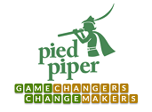

# Service Dogs App
This repo contains the code produced by the students of the Pied Piper program that took place in Sydney in June 2019. A total of 14 students from Australia, New Zealand and Japan participated in the program and contributed their code to this project

## The Pied Piper program
The Pied Piper program goal is to educate DellEMC pre-sales across APJ and Greater China regions in the various technologies that are fuelling the digital transformation such as Cloud Native apps, Agile, DevOps, IoT and analytics/AI. What makes this program different is that engineers learn by doing (approximately 85% of the 5-day workshop is hands-on). By focusing on doing instead of just listening or reading the learning outcomes are much greater

The program gets its name from the Sillicon Valley TV series that portraits a group of young guys in California that found a start-up called Pied Piper. In order to lear more about the program visit [this blog articles](http://anzpiper.blogspot.com/2017/08/must-start-somewhere.html)

## The Project

In this occasion, during the 5-day workshop the team undertook a team project to put the leart skills into practice. The idea was to collaborate with a charity so that the project could help somebody in need. After the workshop all team members resumed their day-to-day dutier but some of them kept collaborating on the project by contributing code during 4 more weeks when their personal time allowed it

The project itself was to develop a prototype application to help ASDAC manage their charitative activities. ASDAC (American ...) provides service dogs for military veterans that ... Various service providers collaborate with the charity such as pet stores, airlines and other transport organizations to provide discounts or benefits to the military veterans and their service dogs. However, these Service Providers are facing an increasing amount of fraud by other customers or passengers that pretend their ordinary pets are also service dogs. This abuse ultimately puts the collaboration with ASDAC at risk. Hence the project needs to include a mechanism by which partnering service providers can validate the identity of both the military veteran and the service dog.

The Pied Piper team had to develop a prototype to proof the concept and to show what's possible. The final product will be arranged by different means and developed by somebody else

## The App

### - General Architecture
The app was architected with a modern microservices-based design so that it can be scaled horizontally with ease. The following diagram shows the architecture at a glance.

### - User Interface
There is a web-app front-end UI (User Interface) that provides access to Administrators, Service Providers and Handlers (which is the term used for a military veteran that owns a service dog). The UI also provides a few API calls for apps owned by service providers to integrate with ASDAC's systems to for example print badge or for identity verification. The UI is responsive thanks to the use of Bootstrap CSS

### - Backend Microservices
The backend services that GOT  implemented are the dogs, handlers and document management microservices. Each of them is underpinned by its own database. This allows for scaling the different services independently from each other which can then be load-balanced with ease. This architecture lends itself to the use of specialized databases to meet the need of each micro-service. In this instance all of them have been designed with MongoDB, however given that each micro-service exposes its functionality through a Rest API the database can be changed as long as the Rest API behaviour is maintained. For example a graph database could be used for the handler's database to help ASDAC create a sort of social network where handlers get to build relationships with other handlers potentially helping their condition

### - Other Microservices
Initially the API was going to be done by an additional component that we referred to as the Engine. This module was going to translate any calls coming from the UI into whatever calls to the backed services were required. For reference the repo shows also its code as well as the Authentication service code but in the end neither the Engine nor the Authentication service were integrated into the solution

### - Object Storage
Finally, object storage is used for storing uploaded documents relating to the health or vaccination status of the service dogs, or dogs and handlers photo IDs ans well as the QR codes that are generated automatically when a dog is added to the system to help with verification

### - To Do
When reviewing the code you will notice that given the time and resource constraint not a lot of effort has been put in things like error checking and equally important there is no meaningful security. A login page is provided and without signing in the welcome page only offers some restricted read operations. However the "control panel" where all the functionality has been aggregated can be accessed directly bypassing the login page. This helped accelerate the development

